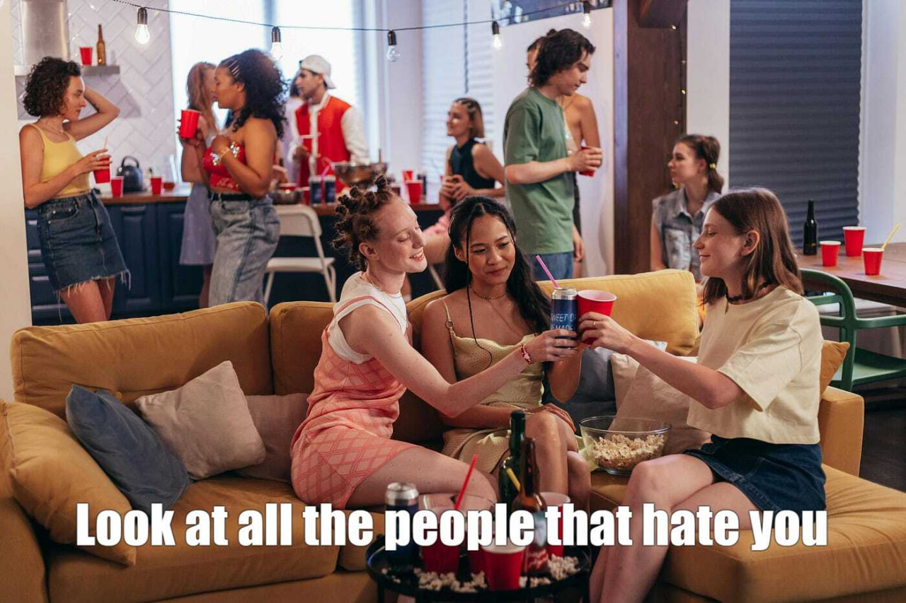
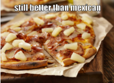
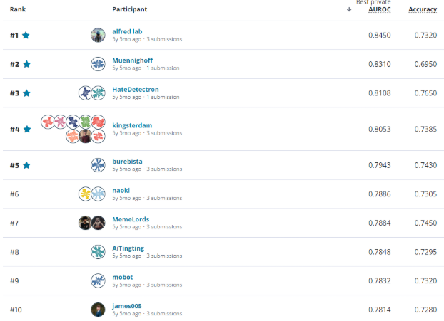

# CS4248-Group-30-Project
This repository hosts the code used for our CS4248 Natural Language Processing Project

Authors: Adrian, Billy, Kenji, Nick, Norbert, Russell 

Mentor: Yisong Miao

## Table of Contents

- [CS4248-Group-30-Project](#cs4248-group-30-project)
	- [Table of Contents](#table-of-contents)
- [Acknowledgements](#acknowledgements)
- [Supplementary](#supplementary)
	- [How did we use MemeCap in our project?](#how-did-we-use-memecap-in-our-project)
		- [1. The RAG Limitation: From Retrieval to Augmentation](#1-the-rag-limitation-from-retrieval-to-augmentation)
		- [2. Leveraging Semantic Fluidity for CARA](#2-leveraging-semantic-fluidity-for-cara)
	- [The confounder problem](#the-confounder-problem)
	- [Why did we split the classification task into two steps?](#why-did-we-split-the-classification-task-into-two-steps)
		- [Output comparison](#output-comparison)
	- [So why did we use RoBERTa as a judge instead of LLM?](#so-why-did-we-use-roberta-as-a-judge-instead-of-llm)
	- [Why does RAG with MemeCap not work on our problem?](#why-does-rag-with-memecap-not-work-on-our-problem)
	- [LMM Supervised fine-tuning performed decently why didn't we just do that?](#lmm-supervised-fine-tuning-performed-decently-why-didnt-we-just-do-that)
	- [Explainability](#explainability)
	- [Model Performance](#model-performance)
- [AI Declaration](#ai-declaration)
- [External Resources](#external-resources)
- [References](#references)
	- [Remote cluster workflow (send code, setup, run)](#remote-cluster-workflow-send-code-setup-run)
		- [1) Set up passwordless SSH from WSL (one time)](#1-set-up-passwordless-ssh-from-wsl-one-time)
		- [2) Send code to cluster](#2-send-code-to-cluster)
		- [3) Setup environment on cluster (first time, or when deps change)](#3-setup-environment-on-cluster-first-time-or-when-deps-change)
		- [4) Run inference on GPU](#4-run-inference-on-gpu)


# Acknowledgements
We would like to thank Yisong Miao, Prof Christian Von Der Weth and Prof Min-Yen Kan for their guidance and support throughout the project.

# Supplementary

## How did we use MemeCap in our project?

### 1. The RAG Limitation: From Retrieval to Augmentation

Initially, we utilized MemeCap (a dataset providing rich, literal, and metaphorical descriptions of memes) within a Retrieval-Augmented Generation (RAG) pipeline. The goal was to retrieve similar meme "contexts" to help classify new ones.

However, we observed that:

- Contextual Sparsity: RAG was limited by the existing "knowledge" in the vector database. If a meme’s specific visual-textual combination was unique, the retrieved context was often irrelevant or too generic.

- Surface-Level Matching: RAG often matched memes based on visual similarity rather than the underlying hate logic.

To solve this, we moved from retrieving context to generating it. We augmented the Facebook Hateful Meme (FHM) dataset by adopting the MemeCap annotation structure for every FHM entry, hoping that the generated literal and metaphorical descriptions would provide richer, more nuanced information for classification. However, we found the similar problem of the generated context being too generic and not providing the necessary information for classification.

### 2. Leveraging Semantic Fluidity for CARA
As we built this augmented dataset, we noticed a critical characteristic of memes: The Metaphor-Meaning Duality. The same visual metaphor (e.g., a "trash can" or "cleaning a house") can be semantically fluid. Depending on the textual overlay, that single metaphor can shift between:

1. A Benign Interpretation: "Cleaning up the environment."
2. A Hateful Interpretation: "Ethnic cleansing or dehumanization."

This fluidity is the key component for our Contrastive Adversarial Reasoning Architecture (CARA). Because one metaphor can branch into two opposing meanings, it allows the model to perform a Counterfactual Analysis:

- The Task: We force the model to generate (or evaluate) both a "Benign Interpretation" and a "Hateful Interpretation" for the same metaphor.
- The Result: By comparing these two branches (Contrastive Reasoning), the model identifies exactly which semantic "pivot" makes the meme hateful. It stops looking for "bad words" and starts looking for the intentionality behind the metaphor.

## The confounder problem
Confounding memes where benign text + benign image = hateful are a common problem in multimodal hate speech detection. This is because instead of pattern matching, it requires true reasoning for detection.

For example, the following memes both have the same text but the different benign images lead to different interpretations.




## Why did we split the classification task into two steps?
Research has also shown that Chain-of-Thought may be an illusion, where if a model has a slight bias towards classifying an image or text as harmful or benign, it will generate tokens that mimic the statistical distribution of human explanations that lead to that specific outcome instead of exploring logical paths to determine the outcome  (Turpin et al., 2023). It is reverse-engineering a justification to fit the initial probabilistic lean.

Example:



This is a benign (ground truth) meme where the LMM rationalise instead of actually reasoning with both hateful and benign interpretations.

### Output comparison

| Model output | Label | Explanation |
|---|---|---|
| LMM output | Hateful | The OCR text "still better than mexican" is interpreted as a derogatory comparison targeting Mexican cuisine, and the neutral pizza image is judged not to offset the harmful text. |

| CARA-generated contrastive hypothesis | Metaphor | Meaning |
|---|---|---|
| Hateful | Close-up of pizza slice with charred crust | The pizza's "perfect" appearance is contrasted with the implied "imperfection" of Mexican food, reinforcing a negative judgment. |
| Benign | Close-up of pizza slice with charred crust | The image can be interpreted as purely descriptive of food texture and appearance, without inherent judgment about other cuisines. |

This forces CARA to explicitly consider both hateful and benign interpretations before deciding, which led to a **Benign** output for this example.

## So why did we use RoBERTa as a judge instead of LLM?
The decision to use RoBERTa over LLM-as-a-judge is due to how this is more of a classification task and how encoder-only models and large generative models handle classification tasks.

Encoder-only is designed for bidirectional language understanding and sequence classification and excels at entailment tasks, whereas Generative LLMs are decode-based, autoregressive models optimised for next-token prediction.

When we tried to use LLM-as-a-judge during testing, slight differences in prompts and text can also severely alter the final outputs from LMMs, making them unsuitable for a judge. Research has also shown that LLMs prefer convincingly written sycophantic responses over correct ones (Sharma et al., 2025).

## Why does RAG with MemeCap not work on our problem?

We prepared embeddings using the facebook dataset. When we then ran the same pizza meme through a RAG model. This was what we got.


```
"score": 0.3227677345275879,
"metaphor": "a bald man",
"meaning": "Americans",
"title": "Also Guatemala works"

"score": 0.32171958684921265,
"metaphor": "same black cat",
"meaning": "mexican beans",
"title": "I didnt make this. Just a Facebook find."

"score": 0.3023276925086975,
"metaphor": "the right image",
"meaning": "Europeans",
"title": "I have been told that McDonalds in Europe tastes better too."
```

This showed that the RAG model was looking for words that aligned with the word “mexican” and therefore provided an output that talked about “a bald man”, “mexican beans”, etc. This made us realise that “context” in memes differs greatly from the context normally RAG models are used for (Answering questions related to a certain topic, etc.). Memes require larger inferential leaps to arrive at the intended intention. As such, adding the RAG model only served as more noise for our model, reducing the accuracy.

## LMM Supervised fine-tuning performed decently why didn't we just do that?
Preliminary fine-tuning of Qwen3-VL demonstrated promising improvements. However, the path toward a high-performing teacher-student distillation requires significant compute resources currently beyond our available infrastructure. Consequently, we shifted our focus toward a more resource-efficient reasoning architecture. Furthermore, the initial baseline test of the Qwen3-VL 32B only achieved an accuracy of around 0.72, which was not significantly better than our CARA model. Given the compute constraints and the competitive performance of CARA, we decided to prioritize the development and refinement of our reasoning-based approach.

## Explainability
One of the key advantages of CARA is its inherent explainability. By generating contrastive pairings of both hateful and benign interpretations for a meme’s metaphors and meanings, the model provides a clear rationale for its classification decisions. This process allows for the identification of the specific semantic pivot that leads to a hateful classification, which is crucial for building trust in the model's predictions. By moving beyond simple binary labels, this approach offers a transparent method for understanding how context influences intent, making it easier to identify potential biases or specific areas for future improvement.

## Model Performance

| Model | Accuracy | AUROC |
|---|---:|---:|
| CARA | 0.738 | 0.807 |

Comparing our results to the leaderboard of Facebook Hateful Memes Challenge in 2021, our model would perform well, possibly placing in the 5th or 6th place.



As the competition was held quite a while ago, we also did a little more research on recent research papers to see how SOTA models performed on the same dataset. Only in the last few years have we seen significant improvements in the performance of models on this dataset, with the introduction of LMMs and better training techniques. The most recent paper also started to explore explainability in hateful meme detection, which is a direction that we also took with our project.

Only recently have we seen models that are able to achieve an accuracy of above 80% and an AUROC of above 90%. This shows that there is still a lot of room for improvement in this task, and that the task is still quite challenging.

| Model | Acc | AUROC |
| :---- | :---- | :---- |
| [ExPO-HM](https://arxiv.org/abs/2510.08630) (Mei et al., 2026\) | 76.5 | \- |
| [RA-HMD (Qwen2.5-VL-7B)](https://aclanthology.org/2025.emnlp-main.1215/) (Mei et al., 2025\)  | 82.1 | 91.1 |
| [RA-HMD (Qwen2.5-VL-2B)](https://aclanthology.org/2025.emnlp-main.1215/) (Mei et al., 2025\)  | 79.1 | 88.4 |
| [PromptHate](https://aclanthology.org/2022.emnlp-main.22/) (Cao et al., 2022\)  | 72.98 | 81.45 |

*Note: ExPO-HM scores are different as they used facebook hateful memes dataset along with other hateful meme detection test sets.

# AI Declaration
This project uses the following AI tools:
- Copilot Auto for quick scaffolding and boilerplate code for our own experiments and tests. It was also used for general debugging.
- Gemini Pro Nano Banana was used to generate images in early stages of the poster for STePS
- Copilot Auto was used to generate the bash scripts used for remote cluster usage, but these were heavily modified by us to fit our needs and the cluster environment.

# External Resources
- Facebook Hateful Memes Dataset: https://www.kaggle.com/datasets/parthplc/facebook-hateful-meme-dataset
- Unsloth Fine-tuning Notebooks: https://unsloth.ai/docs/get-started/unsloth-notebooks
- MemeCap: https://github.com/eujhwang/meme-cap

# References
Turpin, M., Michael, J., Perez, E., & Bowman, S. R. (2023, December 9). *Language models don’t always say what they think: Unfaithful explanations in chain-of-thought prompting*. arXiv.org. https://arxiv.org/abs/2305.04388

Sharma, M., Tong, M., Korbak, T., Duvenaud, D., Askell, A., Bowman, S. R., Cheng, N., Durmus, E., Hatfield-Dodds, Z., Johnston, S. R., Kravec, S., Maxwell, T., McCandlish, S., Ndousse, K., Rausch, O., Schiefer, N., Yan, D., Zhang, M., & Perez, E. (2025, May 10). *Towards understanding sycophancy in language models*. arXiv.org. https://arxiv.org/abs/2310.13548

Mei, J., Sun, M., Chen, J., Qin, P., Li, Y., Chen, D., & Byrne, B. (2026, March 1). *Expo-HM: Learning to explain-then-detect for hateful meme detection*. arXiv.org. https://arxiv.org/abs/2510.08630

Mei, J., Chen, J., Yang, G., Lin, W., & Byrne, B. (2025). Robust adaptation of large multimodal models for retrieval augmented hateful meme detection. *Proceedings of the 2025 Conference on Empirical Methods in Natural Language Processing*, 23817–23839. https://doi.org/10.18653/v1/2025.emnlp-main.1215

Cao, R., Lee, R. K.-W., Chong, W.-H., & Jiang, J. (2022). Prompting for Multimodal Hateful Meme Classification. *Proceedings of the 2022 Conference on Empirical Methods in Natural Language Processing*, 321–332. https://doi.org/10.18653/v1/2022.emnlp-main.22

## Remote cluster workflow (send code, setup, run)

This project uses three scripts for remote usage:

- `deploy_and_submit.sh`: sync local code to the cluster (deploy only).
- `remote_setup.sh`: create `.venv` and install Python dependencies on the cluster.
- `remote_run.sh`: run inference on GPU (uses `srun` automatically if needed).

### 1) Set up passwordless SSH from WSL (one time)

To avoid entering your password every time, configure SSH key-based auth first.

1. Generate an SSH key (run in WSL):

```bash
mkdir -p ~/.ssh
chmod 700 ~/.ssh
ssh-keygen -t ed25519 -C "wsl@$(hostname)" -f ~/.ssh/id_ed25519
```

2. Copy your public key to the remote host (replace user/host):

```bash
ssh-copy-id -i ~/.ssh/id_ed25519.pub <name>@xlogin.comp.nus.edu.sg
```

If `ssh-copy-id` is not available, run:

```bash
cat ~/.ssh/id_ed25519.pub | ssh <name>@xlogin.comp.nus.edu.sg 'mkdir -p ~/.ssh && chmod 700 ~/.ssh && cat >> ~/.ssh/authorized_keys && chmod 600 ~/.ssh/authorized_keys'
```

3. (Optional) Use `ssh-agent` to cache your key passphrase:

```bash
eval "$(ssh-agent -s)"
ssh-add ~/.ssh/id_ed25519
```

4. Configure a convenient SSH host entry in `~/.ssh/config`:

```
Host xlogin
	HostName xlogin.comp.nus.edu.sg
	User <name>
	IdentityFile ~/.ssh/id_ed25519
	AddKeysToAgent yes
```

### 2) Send code to cluster

From your local project root:

```bash
./deploy_and_submit.sh
```

This syncs code to `~/CS4248/<project-folder>` on the remote and excludes `.venv`, `venv`, `.env`, and `models`.

### 3) Setup environment on cluster (first time, or when deps change)

```bash
ssh <name>@xlogin.comp.nus.edu.sg
cd ~/CS4248/<project-folder>
chmod +x remote_setup.sh remote_run.sh
./remote_setup.sh
```

### 4) Run inference on GPU

Interactive run (recommended for quick testing):

```bash
ssh <name>@xlogin.comp.nus.edu.sg
cd ~/CS4248/<project-folder>
./remote_run.sh --prompt "Hello"
```

Batch run with Slurm:

```bash
ssh <name>@xlogin.comp.nus.edu.sg
cd ~/CS4248/<project-folder>
sbatch remote_job.sbatch
```

Check jobs/logs:

```bash
squeue -u $(whoami)
tail -f slurm-<jobid>.out
```

Notes:
- Ensure remote `~/.ssh` permissions are `700` and `authorized_keys` is `600`.
- If your institution requires additional authentication (2FA, LDAP), follow local instructions or contact admins.
- If `remote_job.sbatch` is used, run `./remote_setup.sh` first so `.venv` exists before the batch job starts.
